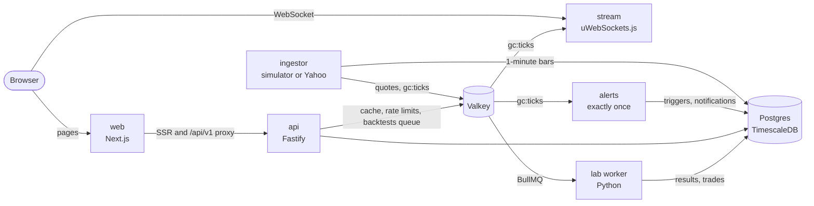

# GreenCircuits

A research and strategy-testing project for Indian markets. It has three parts:

- **a daily market brief**;
- **company pages** that read like reports;
- **a lab** that backtests investing ideas with Indian costs, from SIPs and rebalancing to entry and exit rules.

It is built in the shape of a real system:

- PostgreSQL with TimescaleDB, and a REST API;
- a market-data ingestor and a WebSocket gateway;
- an alert engine that fires each alert exactly once;
- Python backtest workers behind a queue.

The target is 100,000 requests an hour and 1,000 concurrent users, and load tests will show whether it gets there.

It is a portfolio project, not a product. Out of the box, prices come from a market simulator and company figures are generated. One command loads real data from free sources instead, for use on your own machine ([Real data, locally](#real-data-locally)). Nothing here is investment advice.

> Green is up on Indian market screens, and a circuit is the exchange's daily price band.

## What works

- **Today:** a daily brief written from the state of the market: a headline, the index's day, what moved and why, sectors, and what's coming up. It also asks "Would it have worked?" of three ideas, using ten years of index history.
- **Company pages:** price, the five numbers that matter, and P/E against the company's own history and its sector. Then financials, ownership, peers and events, all read from the database.
- **Accounts:** email and password, on server-side sessions ([ADR 0006](docs/adr/0006-accounts-and-sessions.md)).
  - Every visitor gets an anonymous account from the first click ([ADR 0002](docs/adr/0002-anonymous-accounts.md)). Signing up keeps it, and signing in from another browser merges what was made there.
  - Watchlists, alerts, holdings, tests and preferences live in Postgres, and can be downloaded as JSON or deleted.
- **For you:** a feed on Today about the stocks you follow: unusual moves, 52-week highs and lows, results and dividends in the coming week, alerts that went off, finished tests, and the stocks that meet your tested rules today. It's ranked for long-term investors or traders, and can follow whole sectors.
- **Alerts:** checked on every tick, fired exactly once, and delivered as in-app notifications.
- **The lab:** describe an idea in sentences, as a monthly SIP (optionally waiting for dips), an equity and bond mix, or entry and exit rules, and get a report.
  - **The engine:** tests are queued on BullMQ and run by a Python engine ([ADR 0001](docs/adr/0001-backtest-jobs-on-a-queue.md)). It fills at the next day's open and charges STT, stamp duty, exchange fees, GST and DP charges. With the backend off, a TypeScript copy runs the same tests in the browser; golden files keep the two engines agreeing ([ADR 0005](docs/adr/0005-backtest-engine-in-the-browser.md)).
  - **The alternative:** every result sits next to the obvious alternative: a plain SIP, the same SIP in the index, a fixed deposit, all equity, or buying and holding.
  - **The report:** it has the growth chart, the numbers, drawdowns, month-by-month returns and trades, plus a held-out final 30% of the period that shows whether an edge survives.
- **Demo mode:** with the backend off, the site still works, running the simulator in the browser ([ADR 0003](docs/adr/0003-live-and-demo-modes.md)).
- **Real data, locally:** `pnpm data:real` loads ten years of NSE prices, results, shareholding, index membership, events, flows and IPOs from Yahoo Finance and NSE. The ingestor then follows real prices, and every page says whether it's showing real or sample figures ([ADR 0007](docs/adr/0007-real-data-for-local-use.md)).

Not done yet: the screener, F&O, IPO, bond and commodity pages in the new design. See the [roadmap](#roadmap).

## Architecture



- **Data:** the SQL schema in [`db/`](db) is the source of truth; numbered migrations sit on top of it. The seed loader fills it with five years of daily bars, statements, valuations, bonds and IPOs for 66 instruments.
- **Live prices:** the ingestor publishes changed quotes every 250 ms. The gateway conflates them per client and copes with slow sockets. Frames are compact JSON arrays ([ADR 0004](docs/adr/0004-json-quote-frames.md)).
- **Contracts:** Zod schemas in [`packages/contracts`](packages/contracts) are shared by the web app, the API and, through stored definitions, the Python engine.

The full design, including specs, capacity maths, the schema, hosting and the load-test plan, is in [`docs/blueprint.html`](docs/blueprint.html); download it and open it in a browser. Decisions are recorded in [`docs/adr`](docs/adr).

## Getting started

Requirements:

- Docker;
- Node.js 22 or later;
- pnpm 12 (`npx pnpm@12.6.0` works if corepack doesn't);
- Python 3.12 with [uv](https://docs.astral.sh/uv/).

```bash
cp .env.example .env
pnpm install
pnpm infra:up        # TimescaleDB and Valkey; the migrate service applies the schema
pnpm db:seed         # the demo dataset, in about five seconds
cp apps/web/.env.example apps/web/.env.local   # live mode: the web app uses the API and the gateway
pnpm dev             # the web app, API, gateway, ingestor and alert engine
```

In a second terminal, start the backtest worker:

```bash
cd pipelines && uv sync && uv run python -m greencircuits.lab.worker
```

Then open http://localhost:3000. The API docs are at http://localhost:4000/docs.

| Process | Port | Health check |
| --- | --- | --- |
| web | 3000 | |
| api | 4000 | `/health`, which also reports feed freshness |
| stream | 4001 | `/health` |
| ingestor | 4010 | `/health` |
| alerts | 4011 | `/health` |
| lab worker | 4020 | `/health` |
| Postgres | 55432 | |
| Valkey | 6380 | |

The database and Valkey ports avoid clashing with other local projects. Change `GC_DB_PORT` or `GC_VALKEY_PORT` in `.env` if they do.

- **Demo mode only:** run `pnpm --filter web dev` without `apps/web/.env.local`.
- **After pulling new migrations:** run `pnpm db:migrate`.

## Tests

```bash
pnpm typecheck && pnpm lint && pnpm test          # types, lint and unit tests
pnpm --filter @greencircuits/api test:integration # the API against the running stack
LAB_E2E=1 pnpm --filter @greencircuits/api test:integration   # and a backtest through the worker
pnpm db:test                                      # schema smoke checks in a throwaway database
cd pipelines && uv run pytest && uv run ruff check
```

The unit tests include the golden-file check between the Python and TypeScript engines. After changing the engine, rewrite the golden file with `uv run python -m greencircuits.lab.parity --write` (in `pipelines/`) and bring the other engine back in line.

[CI](.github/workflows/ci.yml) runs all of these on every push to `main` and on every pull request. The integration job starts TimescaleDB and Valkey as service containers, migrates and seeds a fresh database, starts a backtest worker, and follows a backtest from the API through the queue to its results.

## Hosting and cost

The web app can live on Vercel's free tier permanently, in demo mode. The backend runs with Docker Compose on a laptop, or on a short-lived VM for demos and load tests, so it costs nothing while it's off. CI uses GitHub Actions' free minutes.

## Real data, locally

Out of the box every price comes from the simulator and every company figure is generated, and the masthead says "Demo market". To use real data instead, with the stack running:

```bash
pnpm data:real
```

It takes a few minutes the first time. It loads:

- **prices:** ten years of daily bars for the 49 stocks, 7 indices, commodities and currencies, from Yahoo Finance;
- **companies:** four years of results, quarterly results, balance sheets and cash flows (Yahoo Finance), and shareholding patterns (NSE);
- **the market:** index membership (niftyindices.com), board meetings, dividends, FII and DII flows, and IPOs (NSE).

The ingestor then switches to real prices on its own. It polls them every minute while NSE trades and every 15 minutes otherwise, and adds each day's close to the history.

The masthead shows which you're seeing: "NSE, delayed" while the market is open, "Closing prices" after it shuts. Text written from the data turns to the past tense once the session is over.

- **Rerunning:** run it again on later days to pick up new results and shareholding. Responses are cached per day in `data/`, so a rerun on the same day fetches nothing. `--only prices,snapshot` runs chosen steps, and `--refresh` ignores the cache.
- **Going back to the simulator:** set `FEED_PROVIDER=simulator` for the ingestor. `pnpm db:seed` restores the demo data.
- **After a load:** each page may show the previous data once, from the web app's fetch cache. Reload it.

What isn't real, or only approximately:

- commodities are international futures converted to rupees, not MCX's prices;
- NSE's shareholding summary splits only promoters from the public;
- two indices only have history from the day real data was first loaded;
- option prices are modelled, and open interest, bonds and the sample portfolio are samples.

[ADR 0007](docs/adr/0007-real-data-for-local-use.md) has the details.

These sources are free and unofficial, and their terms allow personal use only. Run real data on your own machine and don't deploy it. A licensed broker feed (Angel One SmartAPI or Fyers, on your own account) would be the next step for live prices.

Backtest results are hypothetical.

## Repository layout

```
GreenCircuits/
├── apps/
│   ├── web/          Next.js web app, live and demo modes
│   ├── api/          Fastify REST API (/v1, OpenAPI at /docs)
│   ├── stream/       uWebSockets.js gateway for live quotes
│   ├── ingestor/     market feed (the simulator, or Yahoo with real data) and 1-minute bars
│   ├── alerts/       alert engine
│   └── worker/       planned: email and Telegram delivery
├── packages/
│   ├── contracts/    wire formats, Valkey keys, strategy and backtest schemas
│   ├── market/       catalog, simulator, formatting, Black-76, research helpers
│   ├── db/           Kysely types, the connection, the demo-data loader
│   ├── backtest/     the backtest engine in TypeScript, for the lab in demo mode
│   ├── feed/         the personalised feed and today's signals from your tested rules
│   └── ui/           planned: shared design tokens
├── pipelines/        Python: the backtest engine, its worker and the real-data loader
├── db/               schema.sql, timescale.sql, migrations/, migrate.sh, tests/
├── compose.yml       local stack: TimescaleDB, Valkey, optional MinIO
├── deploy/, infra/, loadtest/   later: production overrides, load-test machines, k6
└── docs/             blueprint.html, adr/
```

## Roadmap

- [x] **Foundations:** monorepo, Compose stack, the schema (79 tables) and migrations, the simulator, CI
- [x] **Data and API:** the demo-data loader, a REST API with OpenAPI, company pages and the daily brief from the database
- [x] **Realtime:** the ingestor, 1-minute bars in TimescaleDB, the WebSocket gateway, live and demo modes
- [x] **Your data and alerts:** anonymous accounts, synced watchlists, alerts and holdings, and exactly-once alerts with in-app notifications
- [x] **Backtest engine:** the queue, the Python engine with Indian charges and in-sample and out-of-sample results
- [x] **Lab interface:** build, run and read backtests in the new design
- [x] **Lab in demo mode:** the engine in TypeScript, checked against the Python one with golden files
- [x] **Accounts and the feed:** sign-up that keeps anonymous data, sessions, and a personalised feed built the same way on the server and in the browser
- [x] **Real data, locally:** a loader for prices, results, shareholding and market data from free sources, a Yahoo price feed, and labels that say which data a page shows
- [ ] **The rest of the site:** Explore (screener, IPOs, bonds, commodities), F&O, portfolio and watchlists in the new design, and a case-study page
- [ ] **Prove it:** k6 load tests at 100,000 requests an hour and 1,000 sockets, dashboards, published results
- [ ] **Later:** a licensed broker feed, email verification and password reset, email and Telegram alerts, paper trading, walk-forward testing

## License

Not chosen yet.
